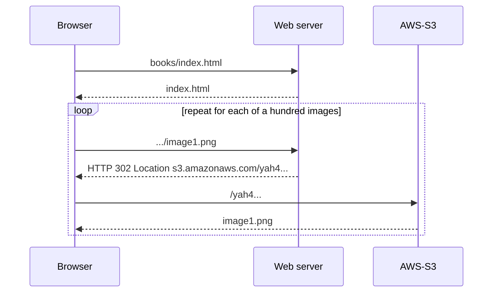
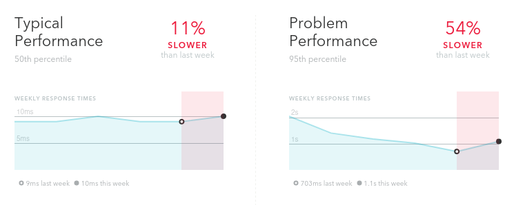

### @═╦╣╚╗ [A mazing engineer](../)

#### 06-Jun-2025 Pitfalls of CDN file uploads

Do you believe that putting a CDN (Content Delivery Network) in front of your web application will cache your static assets and user file uploads?

***This doesn't exactly work like that***. CDNs work in some cases, but not very well by default for public user file uploads.

This article reveals what you should know, and what can be done.

Problems discussed are not specific to the web server, framework, CDN provider, region, or your choice of cloud or bare metal.

#### Background

I worked for a company helping them to deal with the quickly increasing load and reliability issues caused by their exploding popularity.

One easy to spot issue was SQL N+1 fetching URLs of user image file uploads for a user-supplied record (let's call it "book" for simplicity).

| Cover | Title |
| ------------- | ------------- |
| 📘| The blue book |
| 📗| The green book |
| ... | ... |

Reducing the avalanche of 101 SQL requests to just three on this page was an easy fix.

One problem still remained: this page also triggered ***50 HTTP requests*** to the "redirect" endpoint just to get the dynamic S3 URL. It is [done this way](https://guides.rubyonrails.org/active_storage_overview.html#redirect-mode) with flexibility and reliability in mind.
Both on initial load, and when user scrolled down the infinite scroll.

```text
https://<host>/.../blobs/redirect/eyJf.../user-uploaded-image.png
HTTP 302
Location: https://prod-bucket-1.s3.ca-east-1.amazonaws.com/yah4...
Cache-Control: max-age=300, private
```


```mermaid
sequenceDiagram
    Browser->>Web server: books/index.html
    Web server-->>Browser: index.html
    loop repeat for each of a hundred images
        Browser->>Web server: .../image1.png
        Web server-->>Browser: HTTP 302 Location s3.amazonaws.com/yah4...
        Browser->>AWS-S3: /yah4...
        AWS-S3-->>Browser: image1.png
    end
```

<div class=anime>
  <div>
     <span class="circle green"></span>
     <span class=recessed>index.html</span>
  </div>
  <div>
     <span class="circle red"></span>
     <span class=recessed id=image-png></span>
  </div>
</div>

During peak hours, thousands of users were active on that page, causing more than 1K requests per second. And it was getting worse each week.



We were running on Heroku, and were bottlenecked by the number of active Postgres connections (375), shared among web processes and background workers.
We didn't want to waste server resources on serving redirects.

### The (wrong) Solution

An obvious answer? *Put a CDN in front of this endpoint to cache redirects*.

Surprise, there was ***no noticeable change*** to the request rate to this endpoint.

Let's take a step back and look closely at the redirect.
```
Cache-Control: max-age=300, private
```

It was the "HA!" moment. Have you noticed the problem already?

Firstly, it's the [`private` directive](https://developer.mozilla.org/en-US/docs/Web/HTTP/Reference/Headers/Cache-Control):

> Cache that exists in the client. It is also called local cache or browser cache.

This means that the ***CDN does not even attempt to cache***, only the browser does.

Secondly, does the browser cache it for long?

***No, just for 300 seconds***. If the same user reloads the page five minutes later, the cache will miss, and the request will hit the server again.

It's a horrible way to cache, isn't it?

None of those user-uploaded images were private or were supposed to only be served to authorized users. So this directive is really off.

None of those user-uploaded images were subjects to frequent to change. Once uploaded, they remained static. Even if they were, the image URL contains a cryptographic hash, and would certainly change, even if the file name doesn't.

#### The Second Attempt

So I've changed the cache age from the [default 5 minutes](https://guides.rubyonrails.org/configuring.html#config-active-storage-service-urls-expire-in) to one year, hoping to making those URL practically cached forever in clients (browsers). This is similar to what 37signals [did](https://youtu.be/-cEn_83zRFw?si=O3-q_R5iCojo0F-w&t=2740).

***No change on the request rate, again***. WHAT?!

It was due to [how AWS presigned URLs work](https://github.com/rails/rails/issues/31581#issuecomment-419754595):

> attempts to set this value to greater than one week (604800) will raise an exception

Reducing this setting to a maximum allowed value of 1 week *helped reducing the request rate to 30%* 🎉🎉🎉

### Further exploration

I've stopped there quite happy with the 3x load reduction, and focused on other flaws that were sinking our performance.
But it is possible to go further, if this problem is severe for you.

#### Public

Changing private to public would enable CDN caching. But does it make sense?
Cloudflare has 300+ data centres, 50 in just the US, and each of those centres with its own, non-synchronized cache.
Each of those data centres would make a request to our web server at least once.

At least once - because CDNs don't guarantee that they will keep the cache forever. Cache storage costs them, too, and CDNs can evict some or all cached data with no prior notice, causing sudden usage spikes on the originating server.

Well, Cloudflare provides transparent inter-DC sync without bashing the originating server certain on select premium plans. Distributed [sync is hard](https://fly.io/blog/parking-lot-ffffffffffffffff/).

Another consideration was privacy. We had book cover images publicly available, but there were other user-uploaded resources we didn't want to cache on a CDN.

#### Proxy Mode

Web server [could download the attachments from S3, and serve the blob directly to browsers](https://edgeguides.rubyonrails.org/active_storage_overview.html#proxy-mode). It is recommended to put a CDN in front of this.
But ***the same problems as above arise***, plus some new ones, like reliance on AWS S3.

#### Dedicated Uploads Domain

Serve all uploads from a dedicated domain (e.g. https://uploads.mysite.com/) to avoid Postgres connection starvation.
As we were a Platform-as-a-Service (PaaS), allowing customers to run our platform on their custom domains, serving from a centralized uploads domain was inelegant at best.

#### Serving Direct S3 Links

It is possible, simple, quite reliable, and performant to render the index page with [direct S3 links](https://github.com/rails/rails/blob/0bd254ebf835e880d485897d23de667007caa47b/activestorage/app/models/active_storage/blob.rb#L214), instead of serving those links one at a time on the `/blobs/redirect` endpoint:

```diff
- <%= url_for(book.cover) %>
+ <%= polymorphic_url(book.cover) %>
```

### Bottom line

CDN is not a panacea, and they have their limitations and use cases.

Never forget to set anomaly alerts for S3 spendings.
Alternatively, use [Cloudflare R2](https://www.cloudflare.com/developer-platform/products/r2/), which is S3 API compatible, and has zero egress costs.

What is your experience with frequently downloaded user file uploads?

### References

Docs worth reading.

General:
 - [Wikipedia CDN article](https://en.wikipedia.org/wiki/Content_delivery_network)
 - [Web HTTP Caching](https://developer.mozilla.org/en-US/docs/Web/HTTP/Caching)
 - [Cache-Control header](https://developer.mozilla.org/en-US/docs/Web/HTTP/Headers/Cache-Control)
 - [Things Caches Do](https://tomayko.com/blog/2008/things-caches-do)

Cloudflare docs:
 - [CDN architecture](https://developers.cloudflare.com/reference-architecture/architectures/cdn/)
 - [What is a CDN](https://www.cloudflare.com/learning/cdn/what-is-a-cdn/)
 - [Cloudflare and the Cache-Control header](https://developers.cloudflare.com/cache/concepts/cache-control/)
 - [CDN-Cache-Control header](https://developers.cloudflare.com/cache/concepts/cdn-cache-control/)
 - [Selective Caching](https://community.cloudflare.com/t/how-to-prevent-caching-302-redirects/542930)

Heroku docs:
 - [Caching is private by default](https://devcenter.heroku.com/articles/http-caching-ruby-rails#private-content)

Rails guides:
 - [Configuring Active Storage](https://edgeguides.rubyonrails.org/configuring.html#configuring-active-storage)
 - [Redirect mode](https://edgeguides.rubyonrails.org/active_storage_overview.html#redirect-mode)
 - [Active Storage and S3](https://guides.rubyonrails.org/active_storage_overview.html#s3-service-amazon-s3-and-s3-compatible-apis)

Discussions and articles:
 - [Lessons learned from Production Active Storage](https://discuss.rubyonrails.org/t/active-storage-in-production-lessons-learned-and-in-depth-look-at-how-it-works/83289?page=2#your-cdn-will-not-keep-your-images-in-their-cache-despite-what-they-say-25)
 - [Caching HTTP 302](https://stackoverflow.com/questions/12212839/how-long-is-a-302-redirect-saved-in-browser)
 - [Caching HTTP 301](https://stackoverflow.com/questions/9130422/how-long-do-browsers-cache-http-301s)
