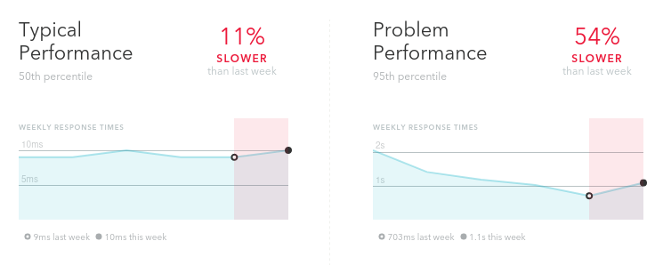

### @═╦╣╚╗ [A mazing engineer](../)

#### 17-Jul-2025 Pitfalls of CDN file uploads

Will putting a CDN (Content Delivery Network) in front of your web application efficiently cache your user file uploads? ***No!***

### Why?

CDNs work in some cases, but not very well by default for public user file uploads.

Below you'll read what you should know, and how you can optimize this.

The problems are not specific to the web server, framework, CDN provider, region, or your choice of cloud or bare metal.

#### Background

One company's popularity exploded, their servers were under an ever-increasing load and started having reliability issues.

Their service's primary "books" index page (let's call it that in this article) displays a list of books each with a user-uploaded cover image.

| Cover | Title |
| ------------- | ------------- |
| 📘| The blue book |
| 📗| The green book |
| ... | ... |

This page triggers ***50 requests*** to fetch images. Both on page load, and when scrolling down.

<div class=anime>
  <div>
     <span class="circle green"></span>
     <span class=recessed>index.html</span>
  </div>
  <div>
     <span class="circle red"></span>
     <span class=recessed id=image-png></span>
  </div>
</div>

To make things worse, images were not served directly, but rather the "/redirect" endpoint redirected to the dynamic S3 URL (it is [done this way](https://guides.rubyonrails.org/active_storage_overview.html#redirect-mode) for flexibility and reliability).

```text
https://<host>/.../blobs/redirect/eyJf.../user-uploaded-image.png
HTTP 302
Location: https://prod-bucket-1.s3.ca-east-1.amazonaws.com/yah4...
Cache-Control: max-age=300, private
```

Sequence:


During peak hours, thousands of users were active on that page, causing more than 1K requests per second. And it was getting worse each week.

<figure>
  
</figure>

On Heroku, servers were bottlenecked by the number of active Postgres connections (375), shared among web processes and background workers. Serving those redirects was wasteful.

### The (wrong) Solution

An obvious answer? *Put a CDN in front of this endpoint to cache redirects*.

Surprise, there was ***no noticeable change*** to the request rate to this endpoint.

Let's look closely at the redirect:
```
Cache-Control: max-age=300, private
```

Have you noticed it already?

Firstly, it's the [`private` directive](https://developer.mozilla.org/en-US/docs/Web/HTTP/Reference/Headers/Cache-Control):

> Cache that exists in the client. It is also called local cache or browser cache.

This means that the ***CDN does not even attempt to cache***, only the browser does.

Secondly, the browser ***caches those images for only 300 seconds***. If the same user reloads the page five minutes later, the cache will miss, and the request will hit the server again.

None of the user-uploaded images were meant to be private.

None of those user-uploaded images were subjects to frequent to change. Once uploaded, they remained static. Even if they were, the image URL contains a cryptographic hash, and would certainly change, even if the file name doesn't.

The initial approach was certainly a mistake.

### The Second Attempt

So I've changed the cache age from the [default 5 minutes](https://guides.rubyonrails.org/configuring.html#config-active-storage-service-urls-expire-in) to one year, hoping to making those URL practically cached forever in clients (browsers). This is similar to what 37signals [did](https://youtu.be/-cEn_83zRFw?si=O3-q_R5iCojo0F-w&t=2740).

***No change on the request rate, again***. WHAT?!

It was due to [how AWS presigned URLs work](https://github.com/rails/rails/issues/31581#issuecomment-419754595):

> attempts to set this value to greater than one week (604800) will raise an exception

Reducing this setting to a maximum allowed value of 1 week *helped reducing the request rate to 30%* 🎉🎉🎉

### Further

#### The Public Directive

Changing `private` to `public` would enable CDN caching.
However, Cloudflare has 300+ data centres, 50 in just the US, and each of those centres with its own, non-synchronized cache.
Each of those data centres would make a request to the originating web server at least once for each user upload.

At least once - because CDNs don't guarantee that they will keep the cache forever. Cache storage costs them, too, and CDNs can evict some or all cached data with no prior notice, causing sudden usage spikes on the originating server.

Well, Cloudflare provides transparent inter-DC sync without bashing the originating server certain on select premium plans. Distributed [sync is hard](https://fly.io/blog/parking-lot-ffffffffffffffff/).

But does it make sense to turn on public CDN caching for user uploads? Only if you have more than a dozen users in each CDN region. Otherwise, you'll barely notice the difference in the number of requests to the originating server.

And, speaking to its name, those uploads have to be public not to breach the privacy. If any of your user's uploads are private, make sure to serve them as such, and don't cache on a CDN.

#### Serve Direct S3 Links

Render the index page with [direct S3 links](https://github.com/rails/rails/blob/0bd254ebf835e880d485897d23de667007caa47b/activestorage/app/models/active_storage/blob.rb#L214), instead of serving those links one at a time on the `/blobs/redirect` endpoint:

```diff
- <%= url_for(book.cover) %>
+ <%= polymorphic_url(book.cover) %>
```

Will become:
```diff
- https://<host>/.../blobs/redirect/eyJf.../user-uploaded-image.png
+ https://prod-bucket-1.s3.ca-east-1.amazonaws.com/yah4...bI2a
```

This means zero requests to the "/redirect" endpoint, and a huge relief for your servers.

### Bottom line

Be mindful when using CDNs: it's not a panacea, and they have their limitations and use cases.

Set anomaly alerts for S3 egress (data is sent out from S3 to the internet) spendings.

Or use the S3-compatible [Cloudflare R2](https://www.cloudflare.com/developer-platform/products/r2/) that has zero egress costs.

### Worthwhile reading on the topic

<div class="note pale-yellow">

#### General
- [Wikipedia CDN article](https://en.wikipedia.org/wiki/Content_delivery_network)
- [Web HTTP Caching](https://developer.mozilla.org/en-US/docs/Web/HTTP/Caching)
- [Cache-Control header](https://developer.mozilla.org/en-US/docs/Web/HTTP/Headers/Cache-Control)
- [Things Caches Do](https://tomayko.com/blog/2008/things-caches-do)

</div>

<div class="note pale-blue">

#### Cloudflare docs

 - [CDN architecture](https://developers.cloudflare.com/reference-architecture/architectures/cdn/)
 - [What is a CDN](https://www.cloudflare.com/learning/cdn/what-is-a-cdn/)
 - [Cloudflare and the Cache-Control header](https://developers.cloudflare.com/cache/concepts/cache-control/)
 - [CDN-Cache-Control header](https://developers.cloudflare.com/cache/concepts/cdn-cache-control/)
 - [Selective Caching](https://community.cloudflare.com/t/how-to-prevent-caching-302-redirects/542930)

</div>

<div class="note pale-green">

#### Heroku docs

 - [Caching is private by default](https://devcenter.heroku.com/articles/http-caching-ruby-rails#private-content)

</div>

<div class="note pale-red">

#### Rails guides

 - [Configuring Active Storage](https://edgeguides.rubyonrails.org/configuring.html#configuring-active-storage)
 - [Redirect mode](https://edgeguides.rubyonrails.org/active_storage_overview.html#redirect-mode)
 - [Active Storage and S3](https://guides.rubyonrails.org/active_storage_overview.html#s3-service-amazon-s3-and-s3-compatible-apis)

</div>

<div class="note pale-orange">

#### Discussions and articles

 - [Lessons learned from Production [Rails] Active Storage](https://discuss.rubyonrails.org/t/active-storage-in-production-lessons-learned-and-in-depth-look-at-how-it-works/83289?page=2#your-cdn-will-not-keep-your-images-in-their-cache-despite-what-they-say-25)
 - [Caching HTTP 302](https://stackoverflow.com/questions/12212839/how-long-is-a-302-redirect-saved-in-browser)
 - [Caching HTTP 301](https://stackoverflow.com/questions/9130422/how-long-do-browsers-cache-http-301s)

</div>
